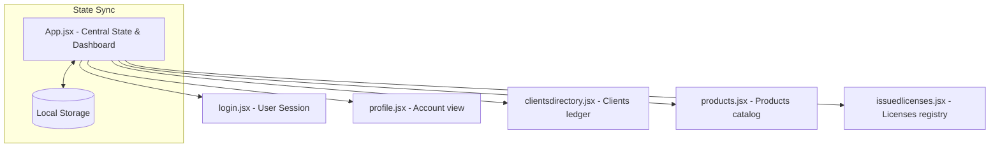

# SoftNet Licensing System - Component Architecture & Knowledge Base

This document details the frontend architecture, component design, reactive state management flows, validation design, and pattern rationales used to complete the **SoftNet Licensing System** portal.

---

## 1. Architectural System Design

The application is structured as a client-side Vite + React Single Page Application (SPA). To keep the footprint low and avoid heavy dependencies, the system utilizes **Vanilla React state Hooks (`useState`)** and **Vanilla CSS inline styling variables**, integrated into a responsive layout.



### State Lifting & Syncing Pattern
All primary databases are lifted to the parent component [App.jsx](file:///Users/pro/beaaaaa/SOFTNET-LS/softls-portal/src/App.jsx). This centralized state:
- Ensures the Home Dashboard statistics recalculate instantly when records are created, adjusted, or revoked.
- Synchronizes with `localStorage` upon every state transition, ensuring data survives browser reloads.
- Feeds a central `activityLog` state that displays a chronological history of user actions on the Home Dashboard.

---

## 2. Component Directory Breakdown

### A. App Component ([App.jsx](file:///Users/pro/beaaaaa/SOFTNET-LS/softls-portal/src/App.jsx))
- **Role**: Bootstrapper, page router, authentication controller, and dashboard metrics processor.
- **Key States**:
  - `page`: `"dashboard" | "licenses" | "products" | "clients" | "renewals"`
  - `licenses`, `products`, `clients`: Central datasets initialized from `localStorage` or initial defaults.
  - `activityLog`: List of log objects `{ id, action, detail, timestamp }`.
- **Knowledge Behind Metrics**:
  - **CSS Charts**: The charts utilize native HTML elements sized dynamically via percentages (e.g. `width: ${(val / maxVal) * 100}%` for category bars and segment-divided flex layouts for compliance sharing) instead of drawing heavy canvas scripts.
  - **Dynamic Expiring Range**: Calculates whether a license is expiring by checking if the contract expiration timestamp is between the current time and a calculated 60-day threshold (`expiringThreshold`).

### B. Login Component ([login.jsx](file:///Users/pro/beaaaaa/SOFTNET-LS/softls-portal/src/assets/login.jsx))
- **Role**: Simulates credential validation and writes user parameters (`userName`, `userRole`, `userEmail`) to `localStorage` to initialize the logged-in admin session.

### C. Profile Component ([profile.jsx](file:///Users/pro/beaaaaa/SOFTNET-LS/softls-portal/src/assets/profile.jsx))
- **Role**: Opens in a modal overlay showing details of the current admin session, supporting sign-out operations.

### D. Clients Directory Component ([clientsdirectory.jsx](file:///Users/pro/beaaaaa/SOFTNET-LS/softls-portal/src/assets/clientsdirectory.jsx))
- **Role**: Client profile register.
- **Completed Subtasks**:
  - **Grid/Table Switcher**: Users can toggle between visual grids (cards) or dense data tables.
  - **Pagination & Search**: Queries are applied in real-time. Results are paginated (5 items per page) to support large tables.
  - **Form Validation**: Submitting the modal validates:
    - *Client Name*: Minimum 3 characters.
    - *Contact Email*: Verified against RFC 5322 regex.
    - *Contact Phone*: Verified for international formats (`+255 ...` or 7-15 digits).
    - *Products*: Ensures at least one checkbox is ticked.

### E. Products Catalog Component ([products.jsx](file:///Users/pro/beaaaaa/SOFTNET-LS/softls-portal/src/assets/products.jsx))
- **Role**: Software catalog registry.
- **Completed Subtasks**:
  - **Properties Validation (SL-38)**: Implemented input controls matching `Name`, `Code`, and `Description` properties.
  - **Code Constraints**: Validates the `Code` field using the regex `/^[A-Z0-9-]+$/` (restricting input to uppercase alphanumeric characters and hyphens, e.g. `SL-SYS`).
  - **Description Constraint**: Restricts descriptions to a minimum of 10 characters to ensure detailed registry documentation.
  - **Layout (SL-39)**: Designs a list-focused registry presenting the name, code, and ellipsis-truncated descriptions clearly.
  - **Toast Notifications (SL-36)**: Emits a green success toast saying `"Product Added Successfully"` upon successful product registration.

### F. Issued Licenses Component ([issuedlicenses.jsx](file:///Users/pro/beaaaaa/SOFTNET-LS/softls-portal/src/assets/issuedlicenses.jsx))
- **Role**: Contract provisioning and lifecycle manager.
- **Completed Subtasks**:
  - **Autocomplete Lookup comboboxes (SL-49)**: Prompts the provisioner with text inputs that filter suggestions in real-time. Typing search parameters suggests matching clients and available products.
  - **Multi-Dropdown filters (SL-50)**: Offers filters to query the license ledger by client, product, or status badge.
  - **Constraints Configuration (SL-48)**: Added settings for maximum active nodes/devices and user accounts.
  - **Suspension Actions (SL-47, SL-51)**:
    - Adds a **Suspend** row button triggering a confirmation warning dialog detailing the consequences of suspending the client's license.
    - Sets the status to `"Suspended"`, which dynamically renders a gray status badge and updates the dashboard metrics.

---

## 3. Core Software Engineering Concepts Applied

### 1. Asynchronous API Delay Simulation
To mock actual backend API behavior, submissions execute within a simulated promise block:
```javascript
setTimeout(() => {
  // Commit to state and local storage...
  setIsSubmitting(false);
}, 600); // 600ms latency simulation
```
This forces a visual spinner state, ensuring the interface handles latency gracefully.

### 2. Safeguarding Destructive Workflows
Destructive operations (such as revoking and suspending contracts) are protected by modal confirmation popups. The warning dialog for license suspension warns the administrator of the technical consequences, preventing accidental downtime.

### 3. Autocomplete Lookups (Combobox UX Pattern)
Autocomplete comboboxes improve UI efficiency. The selection dropdown dynamically filters suggestions based on search input, and when a client is selected, the product selector is automatically filtered to show only that client's contracted products.
